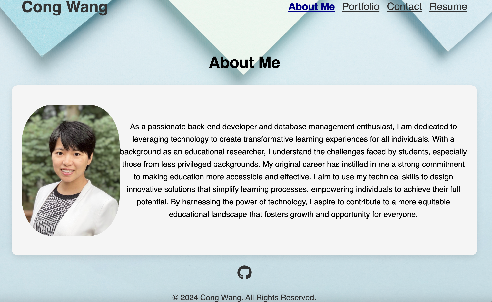
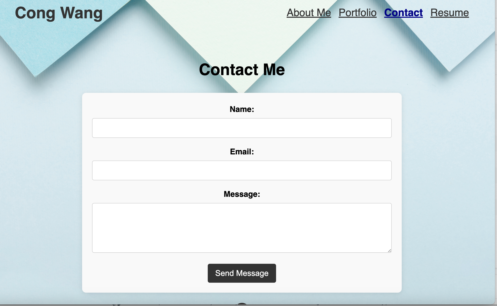

# React + Vite

This is a personal portfolio website built with React and Vite, deployed on Netlify. The website showcases projects, skills, and other professional details in a clean and modern interface.

## Demo

You can check out the live demo of this portfolio website here:
https://hydy1943congwang.netlify.app/

## Features

	•	Single-page application (SPA) built with React
	•	Responsive design for mobile, tablet, and desktop
	•	Fast development with Vite for optimal build times
	•	Portfolio section showcasing projects with descriptions and links
	•	Contact form for visitors to get in touch
	•	Animations and transitions for a polished user experience

## Screenshot

Below are the screenshots of the portfolio website:

